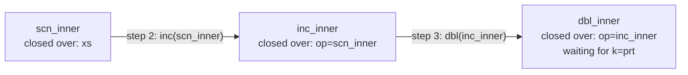
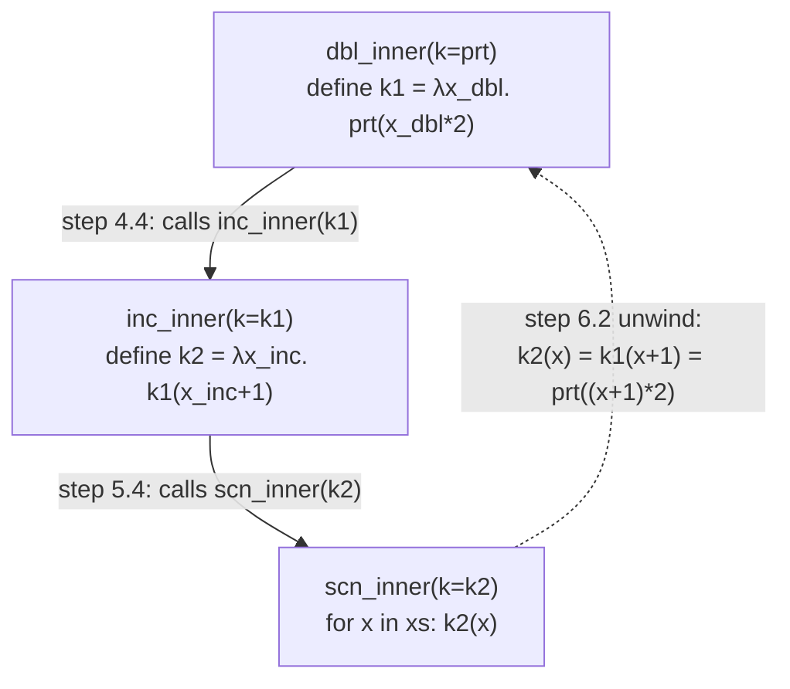
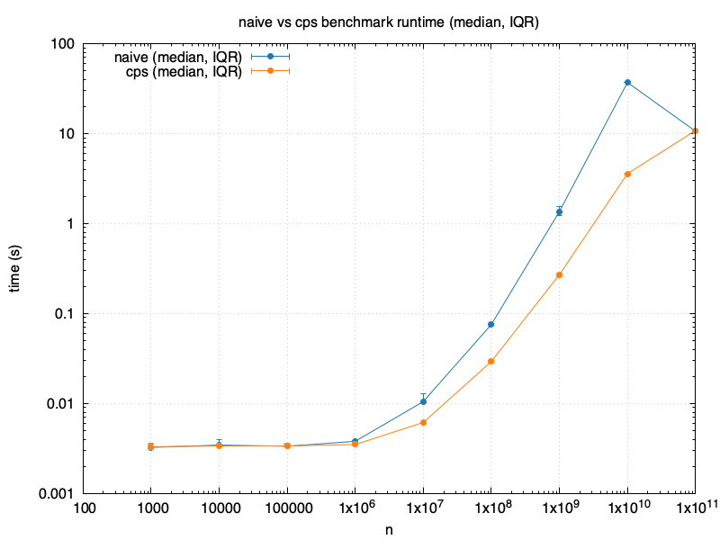

# Continuation Passing Style

A while ago I found the following blog post [https://remy.wang/blog/cps.html](https://remy.wang/blog/cps.html). In order to understand this in more detail I wanted to implement the continuation-passing style (CPS) here in C++.

## Motivation

In a database, or a general data pipeline for that matter, we might want to chain operations on the data. Instead of doing one operation at a time on the whole array of data, we want to try do combine the operations, such that only one pass through the array is neccesary.

### Naive Way

The naive way would be to do one operation on the whole array, save the intermediate results, and then continue with the next operation. Consider the following example from the blogpost.

```julia
inc(xs) = [x + 1 for x in xs]

dbl(xs) = [2 * x for x in xs]
```

A full Python example can be found in [./naive.py](./naive.py):

```python
def inc(xs: list[int]):
    xs2 = []
    for x in xs:
        xs2.append(x + 1)
    return xs2


def dbl(xs: list[int]):
    xs2 = []
    for x in xs:
        xs2.append(x * 2)
    return xs2


def prt(xs: list[int]):
    for x in xs:
        print(f"{x}, ", end="")
    print("")


if __name__ == "__main__":
    xs = np.zeros(N, dtype=int)
    xs = inc(xs)
    xs = dbl(xs)
    prt(xs)
```

We can observe that there are basically 3 loops through the array `xs`. One for `inc`, one for `dbl`, and one for `prt`. Would it not be nice to write

```julia
inc_n_dbl(xs) = [2 * (x + 1) for x in xs]
```

instead?

But this is not feasible to write every possible combination. Therefore, something else is needed.

## Background

This section describes the coding and mathematical background needed.

### Closures

In programming languages, a closure is a function value paired with references to the free variables from its enclosing scope. Consider the following Python code demonstrating a closure function. `f` is the function that returns the closure `_inner`, which is closed over `_x=x`. `_x = x` is only specified explicitly to demonstrate the closed values. When `f` returns, its stack frame is discarded as usual, but `_inner` keeps a reference to `_x`. So `g = _inner` still has access to `_x` and thus can calculate `_x + y`.

```python
def f(x):
    _x = x  # closed value
    def _inner(y):
        print(f"x + y = {_x + y}")
    return _inner  # return the closure

g = f(x = 40)
g(2)  # prints: "x + y = 42"
```

### Currying

The following is a function that takes two arguments (*a,b*) and returns a value *c*:

$$ f(a,b) = a+b. $$

The function can be defined as:

$$ f: (A \times B) \rightarrow C. $$

The Python equivalent is

```python
# normal function
def f(a, b):
    return a+b

f(1, 3)  # = 1+3 = 4
```

Currying describes the mathematical concept of a function that has one argument, but still expects another argument in order to return. Instead of expecting two arguments, only one is expected. And instead of returning a value, a function is returned, that takes one argument (*b* in this case) and returns *c*.

$$ f(a)=\lambda b.(a+b) \equiv f: A \rightarrow (B\rightarrow C) $$

This reads as "*f* of *a* is the function that takes *b* and returns *a+b*".

The above can be written as the following as well:

$$ \begin{align*} g(b) &= a+b \\ f(a) &= g \end{align*}$$

Thus:

$$ f(a)(b) = g(b) =  a+b$$

Python (or Julia) does not natively support currying. We have to use closures for this.

```python
def f(a):
    def g(b):
        return a + b
    return g

f(1)(3)  # = g(3) = 1+3 = 4

# we can also write more explicitly:
g = f(1)
g(3)  # = 1+3 = 4
```

Note how this Python example illustrates nicely how `g` is closed over `a`. `g` remembers the parameter `a`.

We could also write this Python example with lambda functions:

```python
def f(a):
    return lambda b: a + b

f(1)(3)
```

## CPS

CPS is a style of programming in which a function returns its results by sending it to another function (Sussman, Gerald & Steele, Guy. (1998). Scheme: A Interpreter for Extended Lambda Calculus). The blog post describes it as *"[...] to define operators that do things instead of making things"*.

This Section shows how to get to the CPS implementation from the Python code, which is used to understand the C++ code.

### Concept Demonstrated in Python

This Section covers the intuition into CPS demonstrated with Python code for easier understanding.

Function *inc* is defined naivly as:

```python
def inc(xs: list[int]):
    xs2 = []
    for x in xs:
        xs2.append(x + 1)
    return xs2
```

For CPS it is defined as:

$$ inc: Op \rightarrow (k \rightarrow None). $$

The Python equivalent is:

```python
def inc(op):                     # level 1: takes op
    def inner(k):                # level 2: takes k
        op(lambda x: k(x + 1))   # level 3: the actual lambda, applied per-element
    return inner

inc(op)(k)
```

At first this feels different from the currying function `f` in the Background Section. But it's not really. Here in this case `op` and `k` are functions acting on each element `x`, but only the innermost `scan` actually loops. This is why `op(lambda x: k(x+1))` is needed. The lambda function is handed off to `op` to be called later, once per element.

The full Python code for the CPS implementation:

```python
def inc(op):
    def inc_inner(k):
        op(lambda x: k(x + 1))
    return inc_inner

def dbl(op):
    def dbl_inner(k):
        op(lambda x: k(x * 2))
    return dbl_inner

def prt(x):
    print(f"{x}, ", end="")

def scan(xs: list[int]):
    def scn_inner(k):
        for x in xs:
            k(x)
    return scn_inner

xs = [4, 4, 4, 4]
dbl(inc(scan(xs)))(prt)
```

This results in the following execution:

1. `dbl(inc(scan(xs)))(prt)` expands `scan(xs)`
    1. Returns `scn_inner` closed over `xs`
2. `dbl(inc(scn_inner))(prt)` expands `inc(scn_inner)`
    1. `inc(op=scn_inner)` returns `inc_inner` closed over `op=scn_inner`
3. `dbl(inc_inner)(prt)` expands `dbl(inc_inner)`
    1. `dbl(op=inc_inner)` returns `dbl_inner` closed over `op=inc_inner`
4. `dbl_inner(prt)` executes
    1. `dbl_inner(k=prt)` remembers `op=inc_inner`
    2. Runs `op(lambda x_dbl: k(x_dbl * 2))`
    3. Define `k1 := lambda x_dbl: prt(x_dbl * 2)` (for better overview)
    4. Executes `inc_inner(k1)`
5. `inc_inner(k1)` executes
    1. `inc_inner(k=k1)` remembers `op=scn_inner`
    2. Runs `op(lambda x_inc: k(x_inc + 1))`
    3. Define `k2 := lambda x: k1(x + 1)` (for better overview)
    4. Executes `scn_inner(k2)`
6. `scn_inner(k2)` executes
    1. `for x in xs: k2(x)`
    2. `k2(x) = k1(x + 1) = prt((x + 1) * 2)`
    3. -> `for x in xs: prt((x + 1) * 2)`

This detailed step by step expansion illustrates the two phases: closures forming (1.-3.) and execute phase (4.-6.). Step 6 shows the final chaining (continuation passing) of the functions and demonstrates that only one loop is exectued.

Build phase:



Execute phase:



### CPS C++ Implementation

Using the Python CPS code above to implement the C++ code is described in this Section. First, a close implementation is implemented in [cps_naive.cpp](./cps_naive.cpp). This is called naive because it orients itself very close to the Python code and does not yield an increase in performance compared to the [naive.cpp](./naive.cpp) implementation. Then, the problem is described and an improved version is written in [cps.cpp](./cps.cpp), which yields an increase in performance.

TODO: The goal is also to read and understand the assmbly code (cps.s) and proof that the compiler actually unfolds the n loops into one pass.

#### CPS C++ Naive

The previous Python function is translated into the following C++ function ([./cps_naive.cpp](./cps_naive.cpp)).

```cpp
/* continuation function K of type function <that returns nothing (takes an integer)> */
using K = function<void(int)>;
/* operation OP is a function <that returns nothing (takes a continuation function K)> */
using OP = function<void(K)>;

/* return inc_inner a function that returns nothing, takes a function k of type K*/
function<void(K)> inc(OP op)
{
    return [op](K k)
    {
        op([k](int x)
           { k(x + 1); });
    };
}
```

<!-- Why `std::function` poses a problem: -->
<!-- - `std::function` is **type erasure**: a runtime "mailbox" that hides which concrete callable is inside.  -->
This implementation poses a problem because of the `std::function` which results in **type erasure** ([Dave Kilian, C++ Type Erasure Explained, 2014](https://davekilian.com/cpp-type-erasure.html), [soumyadeep debnath, Understanding Type Erasure Idiom in C++, 2024](https://medium.com/@sonudgr82013/understanding-type-erasure-idiom-in-c-bca2374956ac)). With type erasure the compiler cannot identify what type something has at compile time, it behaves like runtime polymorphism, and its cost shows up as indirect calls. Compiling this code and investigating it by counting the amount of `blr` (indirect call) instructions, it showed that there are 70 of these instructions (using commands: `c++ -O3 -S -c cps_naive.cpp -o cps_naive.s` and `rep -c blr cps_naive.s`). This is the reason why this CPS version is still about 6x slower than the naive implementation, despite doing conceptually less work. Even an `inline` keyword does not do the inline optimization, because it only affects linkage and not whether the compiler can see the callee's body.

<!-- the fix: -->
Templates replace runtime polymorphism with compile-time polymorphism. `template <class T>` on `inc`/`dbl` means `op`'s concrete type is baked in at compile time. A fully concrete `inc` for whatever it is called with is generated. `K k` is the argument supplied later by curring and `inc` itself never refers to it. Therefore it can be replaced with `auto k`. So a signature for `inc` like `template <class T, class U>`, where `T` is for `op` and `U` is for `k` does not make sense. A lambda with `auto` in its parameter list is itself a template. Every "waiting for later" value in this chain (`scan(xs)`, `inc(...)`, `dbl(...)`) is a generic lambda, which `operator()` is itself a template. So the compiler does not generate concrete code for its body until it is called with concrete argument types. That instantiation only happens once the full call chain resolves, which is why the compiler can see straight through it and emit a direct call instead of an indirect one. Now compiling and counting `blr`s (using `c++ -O3 -S -c cps.cpp -o cps.s` and `grep -c blr cps.s` commands) gives `1`.

#### Improved C++ CPS

This Section describes the impoved version ([cps.cpp](./cps.cpp)).

The compiler is forced to decide what `k(x)` means. With `std::function` the decision is deferred to runtime by design. `std::function<void(int)>` is the concrete type no matter what the function `k` does (increase or duplicate). This is also described in [this blog](https://davekilian.com/cpp-type-erasure.html) about "C++ 'Type Erasure' Explained". This means the compiler compiling `k(x)` is compiling code that must work for any function matching the signature.

With a template parameter the decision is made at compile time. Templates replace runtime polymorphism with compile-time polymorphism. Consider the following code. `T` is the specific lambda's own compiler-generated type. The compiler does not have to compile a general `inc`, it compiles a distinct instatioation of `inc`.

```cpp
template <class T>
auto inc(T op)
{
    return [op](auto k)
    { op([k](int x)
         { k(x + 1); }); };
}
```

Now `k(x)` can be inlined. This results in no more `blr` commands in the compiled code. This is the reason why [cps.cpp](./cps.cpp) is faster than the naive implementation now.

## Evaluations

### Setup

TODO: local macos

### Evaluation Measures

TODO: runtime

### Results

TODO: more details


